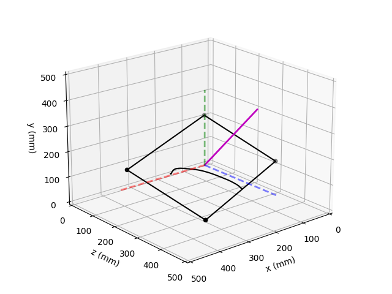
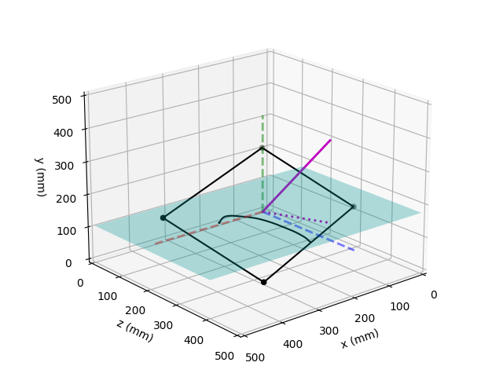
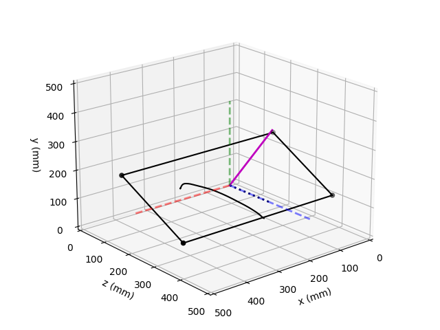
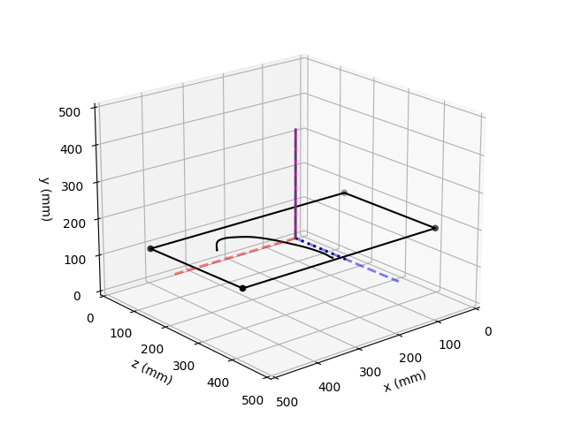

# TAT-HUM: Trajectory Analysis Toolkit for Human Movement

For more details on this toolkit, see the preprint [here](https://psyarxiv.com/4yrk7).

## Abstract
Human movement trajectories can reveal useful insights regarding the underlying mechanisms of human behaviors. 
Extracting information from movement trajectories, however, could be challenging because of their complex and dynamic 
nature . The current paper presents a Python toolkit developed to help users analyze and extract useful information 
from the trajectories of discrete rap-id aiming movements  executed by humans. This toolkit utilizes various open-source 
Python libraries, such as NumPy and SciPy, and offers a collection of commonly used functions to analyze movement 
trajectory data. To ensure flexibility and ease of use, this toolkit offers two approaches: an automated approach that 
processes raw data and generates relevant measures automatically, and a manual approach that allows users to 
selectively use different functions based on their specific needs. A behavioral experiment based on the spatial cueing 
paradigm was conducted to illustrate how one can use this toolkit in practice. Readers are encouraged to access the 
publically available data and relevant analysis scripts as an opportunity to learn about kinematic analysis for human 
movements. 

## Installation

See PyPi project link: https://pypi.org/project/tathum/

```
python3 -m pip install tathum
pip install tathum
pip3 install tathum
```

## Sample Data

To facilitate learning, this toolkit also provides sample data, which can be downloaded through the OSF's online 
repository [here](https://osf.io/24qvm/).

## Quick Start

To quickly become familiar with TAT-HUM, users should refer to the following sample analysis code:

1. ./demo/sample_data_analysis.py
2. ./demo/sample_data_visualization.py

## Implementation
### Data Structure
The toolkit relies on NumPy’s array objects to store and process relevant data. The trajectory data should be stored as 
a csv file with four columns: timestamps, x-, y-, and z- coordinates. Depending on the motion capture system’s 
calibration setup, different coordinate axes could represent different directions in the capture space. Therefore, it 
is essentialy for users to maintain a consistent coordinate system across different calibrations for different sessions. 
Based on the coordinate system, users should identify the primary axis of the participants’ movement (i.e., the axis 
with the most displacement) and the most relevant secondary movement axis using the calibrated coordinate system. 
Assuming this structure, users can simply read the raw data file and assign separate variables to extract information 
from each column:

```python
import numpy as np

raw_data = np.genfromtxt('raw_data.csv', delimiter=',')

timestamp = raw_data[:, 0]
x = raw_data[:, 1]
y = raw_data[:, 2]
z = raw_data[:, 3]
```

If using 2D data from a mouse or graphics tablet, the user could simply create a dummy column for one of the axes 
(e.g., an axis with all zeros) and only focus on the two non-zero axes in the subsequent analysis. 

### Preprocessing
#### Missing Data
When recording human movement using a motion capture system (e.g., Optotrak, Vicon, and OptiTrack), the researcher 
aims to arrange the placement of the cameras and the participant to ensure that the motion tracking marker is visible 
to the cameras for the entire movement.  Despite best efforts, missing data (marker is not recorded by the motion 
capture system) commonly occurs due to the occlusion of the markers from objects in the environement or from the 
participant moving in an unexpected way (e.g., lifts the finger outside of the capture volume or rotates the finger 
too much). These missing data are commonly coded using unique values, such as 0 or an exceedingly large number, to 
differentiate them from points of the actual trajectory. As Figure 1 (top panels) shows, the missing data were marked 
as 0 and could be easily identified. In general, one could consider eliminating all trials with missing data from the 
analysis, and should eliminate trials that are missing data from more than 5%   of the trial.  However, for trials with 
less than 5% missing data, it is possible to recover the trial by interpolating the section of the trial that is 
missing data.

|  |  |
|---------------------------------------------------|-------------------------------------------------|

*Figure 1. Two examples of missing data in the raw trajectory (top panels) and the trajectory with missing data filled 
in using linear interpolation (bottom panels). See text for explanations.*  

In the toolkit, the ```fill_missing_data``` function can automatically process the missing values in the trajectories. The 
users need to supply the x, y, and z coordinates, along with the corresponding time stamps and the default missing data 
value. This function will identify the indices of the missing values and return the coordinates and timestamps with the 
missing values interpolated using linear interpolation from SciPy (Virtanen et al., 2020; Figure 1 bottom panels). More 
importantly, this function also returns a dictionary object  that contains relevant missing data information, including 
whether there are any missing data, the number of missing data, and their indices. As illustrated in the subsequent 
paragraphs, users can use this information to determine whether they would keep the trial or not based on the number 
of locations of the missing values.

```python
from tathum.functions import fill_missing_data

x, y, z, timestamp, missing_info = fill_missing_data(
		x, y, z, timestamp, missing_data_value=0.)

print(f'missing_info = {missing_info}')
```
```pycon
missing_info = {'contain_missing': True, 'n_missing': 3, 'missing_ind': array([346, 347, 348])}
```

In the two examples provided above, the trajectories on the left contain only a few missing data points at around the 
end of the trajectories (the displacements appear to be plateaued at around the missing data), whereas the trials on the 
right contains several missing data segments, one of which occurred before the movement termination (there are missing 
data before the displacements becoming stable and consistent). In the former case, it is unlikely for the linear 
interpolation to introduce artifacts to the dynamic information of the movement during subsequent analysis because 1) 
the interpolated portion may fall outside of the movement initiation and termination and, therefore, will not be 
considered in the analysis, and 2) the interpolated segment is short enough (n = 3) that linear interpolation could 
fill in the missing data without altering the dynamic information in the trajectory. The latter case, however, not only 
contains missing data between movement initiation and termination, but the number of missing data for the segment is 
also quite large (n = 34). Using linear interpolation to fill in the missing values may introduce artifacts to the 
trajectory and affect the validity of the subsequent analysis. Therefore, situations like this may warrant the removal 
of the trial from further analysis. 

Thus, although the present toolkit could automatically handle missing data, caution should still be taken to avoid 
introducing artifacts to the trajectories. The decision between keeping the trial with interpolated values and 
discarding the trial due to missing data relies on two main factors: the locations of the missing data and the number 
of consecutive missing data. Because determining where the missing data are relative to the movement initiation and 
termination requires first identifying where the movement has started and ended, evaluating the validity of the missing 
data handling needs to happen after the movement boundaries have been identified, which, in turn, requires other 
preprocessing steps.

#### Data smoothing
Data smoothing is a critical step in the preprocessing of human movement data. Although the current state-of-the-art 
optical motion capture systems allow precise motion tracking (e.g., for Optotrak, measurement error is commonly smaller 
than 0.2 mm), slight deviations in the position data are still inevitable due to reasons such as marker movement and 
room vibration. Despite the magnitude of these deviations may be relatively small and imperceptible through displacement 
data (Figure 2, left panel, top row), such measurement variability would be amplified when computing the derivatives, 
such as velocity and acceleration (Figure 2, left panels). Therefore, it is essential to smooth the trajectories before 
computing their derivatives.

|  |  |
|------------------------------------------------|--------------------------------------------------|

*Figure 2. Demonstration of the effect of slight measurement deviations (left) and trajectory smoothing using low-pass 
Butterworth filter (right) on the second (i.e., velocity) and third (i.e., acceleration) order derivatives of position.* 

Trajectory smoothing is commonly performed using a low-pass Butterworth filter (Butterworth, 1930) with a cutoff 
frequency of 10 Hz (Franks et al., 1990). The filter included in the present toolkit, ```low_butter```, is a wrapper function 
that combines SciPy’s ```butter``` and ```filtfilt``` functions. It requires three input arguments, the signal, sampling frequency, 
and cutoff frequency, and can directly output the smoothed signal. As Figure 2 (right panel) shows, this filter helps 
to attenuate the frequencies in the signal that are higher than the cutoff frequency, reducing the noise in the signal.

```python
from tathum.functions import low_butter

fs, fc = 250., 10.

x_smooth = low_butter(x, fs, fc)
y_smooth = low_butter(y, fs, fc)
z_smooth = low_butter(z, fs, fc)
```

#### Spatial transformation

Although movements are performed and recorded in a 3D space, the axes of interest should be contingent on the task and 
experimental questions. For instance, for the movement-based spatial cueing paradigm (e.g., Neyedli & Welsh, 2012; Wang 
et al., under review; Yoxon et al., 2019), trajectory analysis should focus on how the relative location between the 
cue and the target affects the spatial characteristics of the movement trajectory. In these studies, the movement’s 
starting position and the locations of the cue and the target share the same two-dimensional (2D) plane and the spatial 
deviations between them are along the longitudinal (away from the participant in depth) and lateral axes in the movement 
plane’s reference frame (the behavioral experiment presented in the current study used a similar experimental setup). 
Therefore, movement trajectories along the longitudinal and lateral axes should be of interest. Depending 
on the calibration of the motion capture system, however, the movement plane’s reference frame may not coincide with 
that reference frame of the trajectory data. 

As Figure 3a demonstrates, the primary and secondary movement axes are longitudinal and lateral axes in the screen’s 
reference frame, which deviates from the reference frame in which the movement was recorded (the default reference 
frame, defined as the three unit axes). This spatial discrepancy could  impose challenges to the 
subsequent analysis if one only wishes to focus on a subset of the movement axes, as the displacement data were 
captured in the default reference frame, not the screen’s reference frame. In other words, because the trajectory is 
constrained by a slanted surface, all three axes are required to perform relevant spatial analysis. To address this 
issue, one can rotate the movement surface and the movement trajectories to be aligned with the default reference 
frame. This rotation only requires the movement surface normal, which can be derived using at least three points on the 
surface. To identify these points, for instance, the experimenters can incorporate a simple screen calibration 
procedure in an upper-limb aiming experiment that asks participants to aim different corners of the movement surface 
(e.g., a computer monitor) as reference points. Alternatively, one can also extract the start and end positions from 
the original movement trajectories and use them as reference points.

| a   |  | b   |  |
|-----|---------------------------------------|-----|-----------------------------------------------|
| c   |       | d   |                   |

*Figure 3. Demonstration of spatial transformation with the movement plane (black rectangle) defined by the four corners 
(black points), its surface normal (magenta line), and the aiming trajectory (black line), where the red 
(x-axis), green (y-axis), and blue (z-axis) dashed lines represent the default reference frame. 
(a) The original spatial layout. (b) The movement plane’s normal is projected onto a horizontal (cyan) plane, where the 
dotted magenta line represents the surface normal’s projection. The angle formed between the projection and the positive 
z-axis (blue dashed line) can be used to align the primary directions between the movement plane and the default 
reference frame. (c) The aligned movement plane after rotation around the y-axis in (b). The angle between the rotated 
surface normal and the positive ¬y-axis can be used to align the movement plane with the ground plane. (d) The final 
spatial layout after the movement plane was aligned to the primary direction and the ground plane.*

In the toolkit, the function ```compute_transformation``` computes the appropriate rotation to align the reference frames. 
This function requires the x, y, and z coordinates of all reference points and the names of the axes based on which the 
rotation should be performed. Specifically, users need to specify the name of the axis that is perpendicular to the 
horizontal plane (e.g., the ground plane), the primary movement axis (to go from Figure 3b to Figure 3c), and the 
secondary movement axis (to go from Figure 3c to Figure 3d).

```python
# the reference points are formatted as an N x 3 matrix
print(reference_points)
```
```pycon
[[ 250.5    78.57 -118.1 ]
 [-254.81   73.88 -119.74]
 [-247.97  -77.02  114.62]
 [ 252.29  -75.43  123.22]]
```
```pycon
# the function requires separate x, y, and z input
rotation, surface_center = compute_transformation(
    reference_points[:, 0],
    reference_points[:, 1],
    reference_points[:, 2],
    horizontal_norm_name='y',
    primary_ax_name='z',
    secondary_ax_name='x', )
```

#### Kinematic Analysis

In addition to position, velocity and acceleration of the movement could also provide useful information. Given 
discrete position measurement and its corresponding time vector, one can obtain the second- and third-order derivatives 
using difference quotients.

This computation can be achieved using the function, ```cent_diff```, from the toolkit. This function takes two inputs, 
a vector with timestamps and a vector with the corresponding signal (this could be position, velocity, or even 
acceleration). The algorithm then performs a two- (forward/backward difference) or three-point (central difference) 
numerical differentiation, depending on where the data point is located. While the three-point central difference 
method provides further smoothing for the resulting derivatives (e.g., velocity and acceleration), the two-point 
methods in the beginning and the end of the data vector ensures the derivatives to line up with the displacement data 
with regard to the total number of samples.

```python
from tathum.functions import cent_diff

x_vel = cent_diff(timestamp, x_smooth)
y_vel = cent_diff(timestamp, y_smooth)
z_vel = cent_diff(timestamp, z_smooth)
```

### Singular Markers
#### Movement boundaries

The boundaries of the movement are marked by movement initiation and termination. Movement boundaries not only provide 
key temporal markers that capture certain aspects of the movement (e.g., reaction time [RT] and movement time [MT]), 
but also help to narrow down the trajectory segments that are of most interest in the trajectory analysis. Movement 
boundaries are typically identified using velocity-based criteria. The function, find_movement_bounds, uses velocity 
and a velocity threshold as inputs to identify the movement boundary, returning indices of the velocity vector that 
marks movement initiation and termination. Movement initiation is defined as the point at which velocity exceeds the 
threshold whereas movement termination is defined as the point at which velocity drops below the same threshold, which 
can be set by the user during function call (Figure 4). 

|  |  |
|-------------------------------------------|------------------------------------------------|

*Figure 4. Demonstration of movement boundaries. The displacement and velocity are of a single dimension, plotted on the 
same time scale. In this example, movement initiation (green dotted line) and termination (red dotted line) are defined 
as when the velocity exceeds and drops below 50 mm/s, respectively. The left column shows a single movement segment 
whereas the right column shows two, where the second segment was due to unnecessary movement after the completion of 
the task-related movement.* 

Because there are three axes to the movement trajectory, the use of velocity could differ depending on the study and 
the primary axis of the movement trajectory. For instance, the example provided in Figure 4 only used a single axis 
(e.g., x-axis) to determine the movement boundaries. In this example, the chosen axis is the principal movement axis 
of the task-relevant direction in which the participant performed the movement. In this case, the velocity input with 
a single dimension is simply a 1D array:

```python
print(coord_single)
```
```pycon
array([220.58679039, 220.53076455, 220.45812056, 220.38970357,
       220.29868951, 220.13652282, 219.65904993, 218.78207948,
       217.66326255, 216.46275817, 215.23037902, 213.9994592 ,...]
```

Alternatively, multiple axes (two or three) could also be used to determine movement boundaries. In such situations, 
the resultant velocity should be used. The resultant velocity can be computed as the Pythagorean of the axes of 
interest. To use resultant velocity instead of velocity along a single dimension, the user can simply use a matrix with 
all the necessary dimensions as input instead of a vector. In other words, the input would just be a 2D array with each 
row corresponds to each sample whereas the two columns represent the two axes based on which the resultant velocity will 
be automatically calculated and used to identify the movement boundaries:

```python
print(coord_double)
```
```pycon
array([[220.58679039, 135.29505216],
       [220.53076455, 135.28456359],
       [220.45812056, 135.28753378],
       [220.38970357, 135.27954967],
       [220.29868951, 135.25909061], ...]
```

Finally, in some studies, the recording of movements occurs during a specific time interval and the participants may 
make unnecessary movements before or after the task-relevant movement. For instance, Figure 4 (right) shows that the 
participants completed the required movement (first segment) and made some small adjustments to position afterward 
(second segment). To address this issue, the function ```find_movement_bounds``` can either automatically select the longest 
movement segment as the task-relevant segment by default, or output movement initiation and termination indices for all 
segments. To obtain indices of all segments, the user can simply set the optional boolean parameter, 
```allow_multiple_segments```, to ```True```. 

```python
from tathum.functions import find_movement_bounds

movement_start_ind, mvoement_end_ind = find_movement_bounds(
    x_vel, velocity_threshold=30., allow_multiple_segments=False)
```

#### Reaction time and movement time

Reaction time (RT) is defined as the time between stimulus onset and movement initiation. For experiments that require 
RT as a dependent measure, the movement recording should start immediately after the stimulus onset. Therefore, RT is 
the time between the onset of data collection and movement initiation (Figure 4, green dotted lines). Movement time 
(MT) is defined as the time between movement initiation and termination. MT is the time interval between the green 
and red dotted lines in Figure 4. In practice, readers can first use the ```find_movement_bounds``` function to find the 
indices that specify the movement boundaries and use them to select the corresponding time stamps to derive RT and MT.

```python
from tathum.functions import find_start_end_pos

timestamp_start = timestamp[movement_start_ind]
timestamp_end = timestamp[movement_end_ind]

# assuming the initiation of movement trajectory collection 
# coincides with stimulus onset
rt = timestamp_start  
mt = timestamp_end - timestamp_start
```

#### Movement start and end positions

Movement start and end positions are, by definition, the positions of the trajectory before and after movement 
initiation and termination, respectively. Given movement boundaries, it is rather straightforward to identify the 
positions. However, unlike the temporal aspects of the movement segment (i.e., RT and MT), the actual  position 
measurements of each individual movement may slightly fluctuate even though the participants remained stationary. As 
Figure 5 shows, the movement trajectory remained largely stable before the movement initiation. However, zooming in on 
that portion of the trajectory reveals slight positional fluctuations before the movement initiation. To address this 
potential issue, when calling the `find_start_end_pos` function, users can optionally specify the number of coordinates 
(`ind_buffer`) to use before and after the movement initiation and termination, and use the average of these coordinates 
as the start and end positions. If the users still wish to use the start and end positions at their instantaneous 
locations, they can set `ind_buffer` to 1. 

```python
start_pos, end_pos = find_start_end_pos(
    	x_smooth, y_smooth, z_smooth, 
    	movement_start_ind, movement_end_ind,
    	ind_buffer=20)
```

|  |  |
|---------------------------------------|-----------------------------------------|

*Figure 5. Illustration of the instability of the starting position. Left: the entire movement trajectory where the 
green dotted line marks the movement initiation. Right: a zoom-in view of the movement trajectory around the movement 
initiation as marked by the black bounding box in the left panel.*

### Spatial Analysis Over Time
#### Trajectory Parameterization

Although the singular markers already offer valuable insights into the underlying dynamics of the movement trajectories, 
sometimes it is also crucial to examine the entire aiming trajectories to gain a more holistic understanding of the 
movement. For instance, comparing the spatial deviations in the trajectories between different conditions can reveal 
the effect of experimental manipulations on movement planning and execution. 

Statistically comparing different trajectories could be difficult. Trajectories from different trials contain different 
numbers of samples at different time stamps. Because of the variability in the samples, averaging the trajectories is 
impossible without normalization. Trajectory normalization is commonly achieved via resampling in the time domain, 
where an array of average positions/velocities/accelerations is computed at evenly spaced fractions of the MT. Although 
time resampling produces an equal number of samples across different trials, as Gallivan and Chapman (2014) reasoned, 
this approach does not preserve the temporal dynamics of the movement and may introduce artifacts in the subsequent 
analysis. Specifically, the resulting samples from time resampling only correspond to the proportion of the MT, not 
in absolute time. If the experimental manipulation affects MT, evaluating the samples’ difference between conditions 
using the proportion of the MT would introduce potential confounds in the analysis. 

An alternative approach is to parameterize the movement trajectory as a function of time, which can be accomplished 
through a third-order B-spline (Gallivan & Chapman, 2014; Ramsay & Silverman, 2005). Using the B-spline function from 
SciPy (Virtanen et al., 2020), movement trajectories along each dimension are mapped onto each point’s corresponding 
time stamp. Subsequently, the trajectories can be resampled using this parameterization and an equally spaced time 
vector measured in absolute time. Unlike the time resampling method, the B-spline approach preserves the temporal 
characteristics of the movement while providing temporal and spatial normalization. To use this function from the 
toolkit, users simply need to call the function `b_spline_fit_1d` and use the time, position, and the number of resampled 
data points as input. 

```python
from tathum.functions import b_spline_fit_1d

x_fit = b_spline_fit_1d(timestamp, x_smooth, n_fit=1000, smooth=0.)
z_fit = b_spline_fit_1d(timestamp, z_smooth, n_fit=1000, smooth=0.)
y_fit = b_spline_fit_1d(timestamp, y_smooth, n_fit=1000, smooth=0.)
```

### Automated Processing Pipeline

The trajectory processing functionalities illustrated above are commonly used in analyzing human movement data. Users 
can independently select the functions to process movement data or adopt a more automated 
approach. This processing pipeline is a collection of all the functions mentioned above, organized in a sequential 
order that is suitable for most trajectory analyses. To use this pipeline, users simply need to instantiate a 
`Trajectory` class with the raw x, y, and z coordinates and an optional time vector, along with a series of other 
optional parameters that, for instance, specify points on the movement surface (for spatial transformation), the 
data’s original sampling frequency, the low-pass Butterworth filter’s cutoff frequency, velocity thresholds.

```python
from tathum.trajectory import Trajectory

trajectory = Trajectory(x, y, z, time=timestamp,
                        principal_dir=principal_ax,
                        fs=250, fc=10,
                        transform_end_points=end_points)
```

Figure 6 shows the processing order of the pipeline. With the raw data, the algorithm first identifies missing data in 
the raw trajectory and recorded the indices for the missing for subsequent processing. Then, if the users supplied 
points on the movement surface when instantiating the `Trajectory` class, the algorithm will automatically compute and 
apply the relevant spatial transformation to the raw movement trajectory. Subsequently, the transformed trajectory is 
smoothed with the low-pass Butterworth filter, and its second- and third-order temporal derivatives are computed and 
smoothed using the same filter. This step yields the velocity and acceleration vectors along each dimension of the 
movement. Based on the velocity profile, movement boundaries can be determined based on the velocity threshold 
specified earlier, which in turn yields MT, RT, and the start and end positions. Finally, the movement boundaries also 
specify the movement trajectory that is parameterized using the third-order B-spline. To access the final, normalized 
trajectory, the users can simply refer to the fields `x_movement_fit`, `y_movement_fit`, and `z_movement_fit`. There is also 
a series of other publically accessible fields to which the readers should refer to the documentation to find the 
relevant ones specific to their purposes.


*Figure 6. The automated data processing procedure. See text for explanations.* 

After going through the data processing pipeline, users can manually check for the validity of the missing data handling 
using the class function `debug_plots`, which creates a plot of displacement and velocity (Figure 7a):

```python
import matplotlib.pyplot as plt

fig, axs = plt.subplots(2, 1)
trajectory.debug_plots(fig=fig, axs=axs)
```

As illustrated in the figure caption, the debug plots provide relevant information about the movement, especially 
movement onset and termination times as well as locations of missing data. As mentioned in the (Missing data)[#missing-data] subsection, 
it is important to examine the locations and extent of the missing data to determine whether the interpolated missing 
values would introduce artifacts to the aiming trajectory. Readers can refer to the sample analysis code for potential 
ways to integrate the inspection component into their analysis.

| a   |  | b   |  |
|-----|---------------------------------------------|-----|------------------------------------------------|

*Figure 7. Demonstrations of the debug plots. (a) Sample plots are generated by the `debug_plots` function. Top: The 
displacement trajectories for the x- (red), y- (red), and z-axis (blue). The vertical cyan and magenta lines represent 
the instances of movement onset and termination, respectively, whereas the horizontal cyan and magenta dotted lines 
represent the displacement values at movement onset and termination for the primary (x) and secondary (z) movement axes. 
The narrow vertical dotted lines and the black segments indicate missing data due to occlusion. Bottom: The 
corresponding smoothed velocity along each axis based on the same color scheme. (b) A sample plot generated by the 
`debug_plots_trajectory` method from the `TrajectoryMean` class. Individual trials for this condition were plotted as 
separate lines marked with their corresponding indices, whereas the green thick line represents the mean trajectory. 
As apparent from the figure, the participants were initially aiming in the wrong direction in trial 5 but corrected the 
movement trajectory halfway through the aim. This trial could be considered an outlier and warrants removal.*

#### Mean trajectories

Given the parameterized individual trajectories, it is also possible to compute the mean trajectories. The 
`TrajectoryMean` class was designed to streamline this process. For instance, users can instantiate this class for 
each participant and each unique combination of conditions. Then, they can just use the class method, `add_trajectory`, 
to store the instances of the `Trajectory` that contains data from a single trial. Once the `TrajectoryMean` object is 
populated with all the trials, the user can optionally visualize the entire set with the class method 
`debug_plots_trajectory` (Figure 7b). As the caption explains, users can use this method to identify potential outliers 
based on the aiming trajectory. To remove a trajectory from the `TrajectoryMean` object, users can simply call the 
`remove_trajectory` method and supply it with the indices of the trajectories to be removed. The sample analysis script 
presents an example of how users can take advantage of this functionality for data inspection.

After setting up the `TrajectoryMean` object, the users can calculate mean trajectories with the 
`compute_mean_trajectory` method. Because the instances of the Trajectory class already have various trajectories 
parameterized using the B-spline method, deriving the mean trajectories simply entails taking the mean values at each 
normalized time step. By default, the normalized movement trajectories (e.g., `x_movement_fit`, etc.) are used to 
calculate the mean trajectories, which are simply saved as a public field of the class (e.g., x_mean and x_sd for 
the mean and standard deviations, respectively). However, users can optionally calculate mean trajectories for 
other fields. For instance, the Trajectory class also contains normalized velocity trajectories within the movement 
range (e.g., `x_vel_movement_fit`). To obtain the mean velocity trajectories, the users can set the method’s input 
traj_means based on the variable of interest. The name of the public fields that store the resulting mean and standard 
deviations always starts with the axis name (e.g., `x`), followed by an optional `post_script` (e.g., `_velocity`) and the 
`_mean` or `_sd` keywords (e.g., `x_velocity_mean`).

```python
from tathum.trajectory_mean import TrajectoryMean

# initialize a TrajectoryMean object
trajectory_mean = TrajectoryMean()

# store a Trajectory object from a single trial
trajectory_mean.add_trajectory(trajectory)

# remove a Trajectory object based on its index
trajectory_mean.remove_trajectory(trajectory_ind)

# compute the mean trajectory after all trial-based Trajectory objects are added
trajectory_mean.compute_mean_trajectory()

# plot all the individual trajectories and the mean trajectory
fig_traj, ax_traj = plt.subplots(1, 1)
trajectory_mean.debug_plots_trajectory(fig=fig_traj, ax=ax_traj)
```