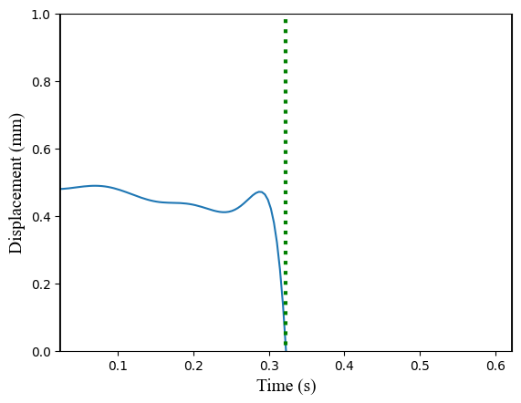
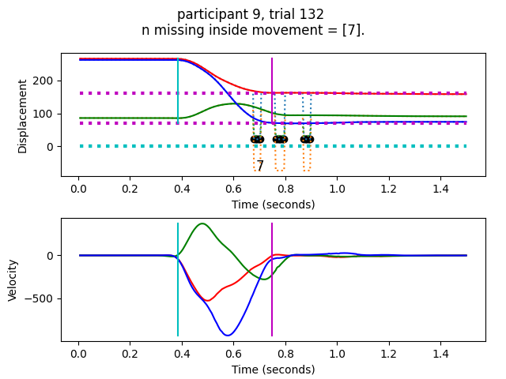
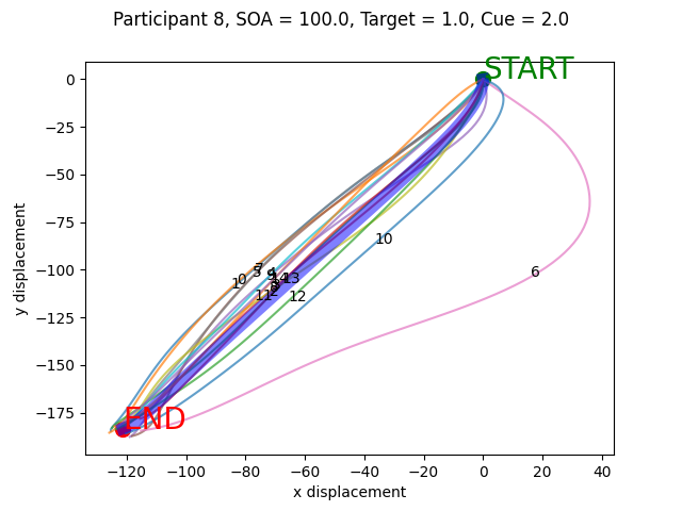

# TAT-HUM: Trajectory Analysis Toolkit for Human Movement

For more details on this toolkit, see the preprint [here](https://psyarxiv.com/4yrk7).

## Abstract

Human movement trajectories can reveal useful insights regarding the underlying mechanisms of human behaviors.
Extracting information from movement trajectories, however, could be challenging because of their complex and dynamic
nature. The current paper presents a Python toolkit developed to help users analyze and extract meaningful information
from the trajectories of discrete rapid aiming movements executed by humans. This toolkit uses various open-source
Python libraries, such as NumPy and SciPy, and offers a collection of common functionalities to analyze movement
trajectory data. To ensure flexibility and ease of use, this toolkit offers two approaches: an automated approach that
processes raw data and generates relevant measures automatically, and a manual approach that allows users to selectively
use different functions based on their specific needs. A behavioral experiment based on the spatial cueing paradigm was
conducted to illustrate how one can use this toolkit in practice. Readers are encouraged to access the publicly
available data and relevant analysis scripts as an opportunity to learn about kinematic analysis for human movements.

## Installation

See PyPi project link: https://pypi.org/project/tathum/

```
python3 -m pip install tathum
pip install tathum
pip3 install tathum
```

## Sample Data

To facilitate learning, this toolkit also provides sample data which can be found in the `./demo/demo_data` folder.

The data in `./demo/demo_data/data_3d` was collected using Optotrak and was a part of the experimental dataset featured
in the manuscript. For the full dataset, please access the OSF repository [here](https://osf.io/24qvm/).

The data in `./demo/demo_data/data_2d` were collected using Optotrak that contain targeted pointing movement performed
on a 2D plane (no vertical movement) from Manzone, Manzone, et al. (2023). The dataset contains two conditions, full
vision during the pointing movement ("full", and hence with online feedback) or a preview of the target before the
movement where the hand was occluded after movement initiation ("preview", and hence is feedforward movement).
Originally, the movement was performed diagonally. Therefore, this dataset also contains a calibration file
(`transform_data_2d.csv`) that can be used to rotate the movement to align with the depth axis.

The data in `./demo/demo_data/data_2d_kinarm` were collected using the KINARM exoskeleton kindly provided by Bev
Larssen. The import the data, users have to use KinArm's custom Python reader, which can be downloaded from
[here](https://kinarm.com/task/kinarm-exam-file-reading-in-python/) (requires subscription). After downloaded, users
can directly copy the folder (KinarmReaderPython) to your project folder and call the import statement:

```python
from KinarmReaderPython.exam_load import ExamLoad
```

## Quick Start

To quickly become familiar with TAT-HUM, users should refer to the following sample analysis code:

1. `./demo/sample_data_analysis.py`
2. `./demo/sample_data_visualization.py`
3. `./demo/sample_data_analysis_2d.py`
4. `./demo/sample_data_analysis_kinarm_2d.py`

## Implementation

### Data Structure

The toolkit relies on NumPy’s array objects to store and process relevant data. The trajectory data should be stored as
a CSV file with at least four columns: timestamps (in seconds or milliseconds), x-, y-, and z- coordinates (in
millimeters or centimeters). Depending on the motion capture system’s calibration setup, different coordinate axes could
represent different directions in the capture space. Therefore, users need to maintain a consistent coordinate system
across different calibrations for different sessions. Based on the coordinate system, users should identify the primary
axis of the participants’ movement (i.e., the axis with the most displacement) and the most relevant secondary movement
axis using the calibrated coordinate system. Assuming this structure, users can simply read the raw data file and assign
separate variables to extract information from each column:

```python
import numpy as np

raw_data = np.genfromtxt('raw_data.csv', delimiter=',')

timestamp = raw_data[:, 0]
x = raw_data[:, 1]
y = raw_data[:, 2]
z = raw_data[:, 3]
```

If using 2D data from a mouse or graphics tablet, the user could simply extract the x and y coordinates from the raw
data file. Moreover, although the trajectory data discussed here were stored as separate files for different trials,
users could also store all trials from the same session/experiment as a single file and parse the trials during analysis
using additional parameter columns (e.g., participant id, trial id, and conditions). The sample analysis code for the
2D data in the online repository demonstrates how to process a single file that contains data from all trials (i.e., see
`sample_data_analysis_2d.py`).

### Preprocessing

#### Missing Data

When recording human movement using a motion capture system (e.g., Optotrak, Vicon, and OptiTrack), the researcher aims
to arrange the placement of the cameras and the participant to ensure that the motion tracking marker is visible to the
cameras for the entire movement. Despite the best efforts, missing data (marker is not recorded by the motion capture
system) commonly occurs due to the occlusion of the markers from objects in the environment or from the participant
moving in an unexpected way (e.g., lifting the finger outside the capture volume or rotating the finger too much).
These missing data are commonly coded using unique values, such as 0 or an exceedingly large number, to differentiate
them from points of the actual trajectory. As Figure 1 (top panels) shows, the missing data were marked as 0 and could
be easily identified.

|  |  |
|---------------------------------------------------|-------------------------------------------------|

*Figure 1. Two examples of missing data in the raw trajectory (top panels) and the trajectory with missing data filled
in using linear interpolation (bottom panels). See text for explanations.*

In the toolkit, the `fill_missing_data()` function can automatically process the missing values in the
trajectories. The users need to supply the x, y, and z coordinates, along with the corresponding timestamps and the
default missing data value. This function will identify the indices of the missing values and return the coordinates
and timestamps with the missing values interpolated using linear interpolation from SciPy (Virtanen et al., 2020;
Figure 1 bottom panels). This function also returns a dictionary object that contains relevant missing data
information, including whether there are any missing data, the number of missing data, and their indices.
Importantly, the algorithm also automatically parses consecutive segments of missing values, yielding each segment’s
corresponding indices and their respective sizes (`missing_info['missing_ind_segments']` and `missing_info
['n_missing_segments']`). As illustrated below, users can use this information to determine whether they would keep
the trial or not based on the locations and numbers of the missing values.

```python
from tathum.functions import fill_missing_data

x, y, z, timestamp, missing_info = fill_missing_data(
    x, y, z, timestamp, missing_data_value=0.)

print(f'missing_info = {missing_info}')
```

The missing_info dictionary contains the following fields:

```pycon
missing_info = {'contain_missing': True,
		'n_missing': 23,
		'missing_ind': array([168, 169, 170, 171, 172, 173, 
				     174, 189, 190, 191, 192, 193, 
				     194, 195, 196, 197, 216, 217, 
				     218, 219, 220, 221, 222]),
		'missing_ind_segments': [
			array([168, 169, 170, 171, 172, 173, 174]),
  		        array([189, 190, 191, 192, 193, 194, 195,
			           196, 197]),
  		        array([216, 217, 218, 219, 220, 221, 222])],
 		'n_missing_segments': [7, 9, 7]
}
```

In the two examples provided in Figure 1, the trajectories on the left contain only a few missing data points at around
the end of the trajectories (the displacements appear to be plateaued at around the missing data), whereas the trials on
the right contain several missing data segments, one of which occurred before the movement termination (there are
missing data before the displacements becoming stable and consistent). In the context of goal-directed pointing,
analysis primarily focuses on the movement, rendering missing data in the first case inconsequential because it is
outside the critical time window of interest. In the second case, the decision between keeping the trial with
interpolated values and discarding the trial due to missing data is important because the missing data occur during the
portion of the trial from which the researcher is attempting to derive usable measures. The decision to keep or discard
a trial based on missing data relies on two main factors: the locations of the missing data and the number of missing
data within a consecutive segment. Because determining where the missing data are relative to the movement initiation
and termination requires first identifying where the movement has started and ended, evaluating the validity of the
missing data handling needs to happen after the movement boundaries have been identified, which, in turn, requires
other preprocessing steps  (see Figure 8a and section [Automated Processing Pipeline](#automated-processing-pipeline).
Further, the trial should definitely be discarded if the missing values happen during movement initiation or
termination.

#### Data smoothing

Data smoothing is a critical step in the preprocessing of human movement data. Although the current state-of-the-art
optical motion capture systems allow precise motion tracking (e.g., for Optotrak, measurement error is commonly smaller
than 0.2 mm), slight deviations in the position data are still inevitable due to reasons such as marker movement and
room vibration. Despite the magnitude of these deviations may be relatively small and imperceptible through displacement
data (Figure 2, left panel, top row), such measurement variability would be amplified during numerical differentiation
(Cappello et al., 1996; Lanshammar, 1982), such as when deriving velocity and acceleration (Figure 2, left panels).
Therefore, it is essential to smooth the trajectories before computing their derivatives.

|  |  |
|------------------------------------------------|--------------------------------------------------|

*Figure 2. Demonstration of the effect of slight measurement deviations (left) and trajectory smoothing using low-pass
Butterworth filter (right) on the second (i.e., velocity) and third (i.e., acceleration) order derivatives of position.*

Trajectory smoothing is commonly performed using a second-order low-pass Butterworth filter to remove the high-frequency
measurement noise (Bartlett, 2014; Butterworth, 1930). In addition to the sampling frequency, the Butterworth filter
also requires the input of a cutoff frequency or the frequency at which the filter begins to attenuate signals.
Inappropriate cutoff frequencies may either overlook the noise (when the cutoff frequency is too high) or introduce
artifacts in the filtered trajectory (Schreven et al., 2015). While studies sometimes use a default cutoff frequency of
10 Hz, the current toolkit also offers an automated approach to identify the optimal cutoff frequency with the
function `find_optimal_cutoff_frequency()`. Assuming the noise in the movement data is additive and normally
distributed with a mean of zero, the optimal cutoff frequency should yield maximally uncorrelated residuals, which
can be evaluated using autocorrelation. The present toolkit uses the method delineated in Cappello et al. (1996).
The residuals of the filtered data were computed for cutoff frequencies ranging between 2 and 14 (Schreven et al.,
2015). The residuals’ autocorrelations are computed for up to 10 sample lags and normalized by the signal’s variance.
The optimal cutoff frequency would produce the smallest sum of squared autocorrelations.

```python
from tathum.functions import find_optimal_cutoff_frequency

fs = 250
fc = find_optimal_cutoff_frequency(x, fs)
```

Subsequently, the Butterworth filter could be applied to the movement data using the optimal cutoff frequency and the
sampling frequency. The filter included in the present toolkit, `low_butter()`, is a wrapper function that combines
SciPy’s `butter()` and `filtfilt()` functions. It requires three input arguments, the signal, sampling frequency, and
cutoff frequency, and can directly output the smoothed signal. As Figure 2 (right panel) shows, this filter helps to
attenuate the frequencies in the signal that are higher than the cutoff frequency, reducing the noise in the signal.

```python
from tathum.functions import low_butter

x_smooth = low_butter(x, fs, fc)
y_smooth = low_butter(y, fs, fc)
z_smooth = low_butter(z, fs, fc)
```

#### Spatial transformation

Although movements are performed and recorded in a 3D space, the axes of interest should be contingent on the task and
experimental questions. For instance, for the movement-based spatial cueing paradigm (e.g., Neyedli & Welsh, 2012; Wang,
Karlinsky, et al., 2023; Yoxon et al., 2019), trajectory analysis should focus on how the relative location between the
cue and the target affects the spatial characteristics of the movement trajectory. In these studies, the movement’s
starting position and the locations of the cue and the target share the same two-dimensional (2D) plane and the spatial
deviations between them are along the longitudinal (away from the participant in depth) and lateral axes in the movement
plane’s reference frame (the behavioral experiment presented in the current study used a similar experimental setup).
Therefore, movement trajectories along the longitudinal (depth) and lateral axes should be of interest. Depending
on the calibration of the motion capture system, however, the movement plane’s reference frame may not coincide
with the reference frame of the trajectory data. For instance, the computer monitor could be slanted (Figure 3).


*Figure 3. An illustration of the reference frame for the experimental setup. A slanted computer monitor is placed on a
horizontal tabletop. The participants are asked to start at the circular home position and use their right hand to
point to one of the square targets. Spatial analysis of the movement trajectory should focus on movements in the lateral
(side-to-side) and longitudinal (depth) directions based on the slanted monitor. However, if the motion capture system
was calibrated based on the horizontal tabletop, the recorded kinematic data would be slanted and contain displacement
(a difference between the start and end location) in three dimensions. Although displacement in all three dimensions
could be relevant in any given study, spatial transformation using linear algebra could be used to transform the
kinematic data to simplify subsequent analysis when 2 dimensions are of interest.*

Figure 4 demonstrates the spatial transformation process that aligns the movement plane. Starting with the initial setup
(Figure 4a), the primary and secondary movement axes are longitudinal and lateral axes in the screen’s reference frame,
which deviates from the reference frame in which the movement was recorded (the default reference frame, defined as the
three unit axes, (i, j, and k). This spatial discrepancy could impose challenges to the subsequent analysis if one
only wishes to focus on a subset of the movement axes. In other words, the movement was performed in a different
reference frame (i.e., the slanted monitor) than the reference in which it was recorded (i.e., the horizontal tabletop).
To address this issue, one can rotate the movement surface and the movement trajectories align them with the default
reference frame. This rotation only requires the movement surface normal, which can be derived using at least three
points on the surface. To identify these points, for instance, the experimenters can incorporate a simple screen
calibration procedure in an upper-limb aiming experiment that asks participants to aim at different corners of the
movement surface (e.g., a computer monitor) as reference points. Alternatively, one can also extract the start and end
positions from the original movement trajectories and use them as reference points.

With the reference points (p_1,p_2,…,p_n), the surface normal, n, for the best-fitting plane can be derived using
singular value decomposition (Soderkvist, 2021), implemented in the scikit-spatial Python library (Pedregosa et al.,
2011). Given the spatial layout (Figure 4a), two rotations are needed to align the reference frames: (1) rotation around
a horizontal plane’s normal direction (y-axis, or j; vertical) to align the primary axis (z-axis, or k; depth), and
(2) rotation around the secondary axis (x-axis, or i; lateral) to make the movement surface to be parallel with the
horizontal plane (xz-plane). Both rotations can be identified using the Gram-Schmidt process for orthonormalization
(Gram, 1883; Schmidt, 1989). Essentially, this process identifies the appropriate angle and axis that transform an
input vector (e.g., the movement plane’s surface normal) to a target vector (e.g., the ground surface normal). For (1),
the target vector is the primary movement direction (blue dashed line; i) whereas the input vector is the movement
surface normal’s projection on a horizontal plane (magenta dotted line; Figure 4b). Similarly, for (2), the target
vector is the ground surface’s normal (green dashed line; j) and the input vector is the movement surface normal
(magenta line; Figure 4c). After the rotation, the movement surface’s normal should be aligned with the horizontal
plane’s normal (Figure 4d).

In the toolkit, the function `compute_transformation_3d()` computes the appropriate rotation to align the reference
frames. This function requires the x, y, and z coordinates of all reference points in the following format:

```python
# the reference points are formatted as an N x 3 matrix
print(reference_points)
```

```pycon
[[ 250.5    78.57 -118.1 ]
 [-254.81   73.88 -119.74]
 [-247.97  -77.02  114.62]
 [ 252.29  -75.43  123.22]]
```

Then, users also need to specify the name of the axis that is perpendicular to the horizontal plane (e.g., the ground
plane), the primary movement axis (to go from Figure 4b to Figure 4c), and the secondary movement axis (to go from
Figure 4c to Figure 4d).

```python
# the function requires separate x, y, and z input
from tathum.functions import compute_transformation_3d

rotation, surface_center = compute_transformation_3d(
    reference_points[:, 0],
    reference_points[:, 1],
    reference_points[:, 2],
    horizontal_norm='y',
    primary_ax='z',
    secondary_ax='x',
)
```

| a   |   | b   |  |
|-----|--------------------------------|-----|---------------------------------------------|
| c   |  | d   |                   |

*Figure 4. Demonstration of spatial transformation with the movement plane (black rectangle) defined by the four corners
(black points), its surface normal (magenta line), and the aiming trajectory (black line), where the red
(x-axis), green (y-axis), and blue (z-axis) dashed lines represent the default reference frame.
(a) The original spatial layout. (b) The movement plane’s normal is projected onto a horizontal (cyan) plane, where the
dotted magenta line represents the surface normal’s projection. The angle formed between the projection and the positive
z-axis (blue dashed line) can be used to align the primary directions between the movement plane and the default
reference frame. (c) The aligned movement plane after rotation around the y-axis in (b). The angle between the rotated
surface normal and the positive ¬y-axis can be used to align the movement plane with the ground plane. (d) The final
spatial layout after the movement plane was aligned to the primary direction and the ground plane.*

In the toolkit, the function `compute_transformation_3d()` computes the appropriate rotation to align the reference
frames. This function requires the x, y, and z coordinates of all reference points and the names of the axes based
on which the rotation should be performed. Specifically, users need to specify the name of the axis that is
perpendicular to the horizontal plane (e.g., the ground plane), the primary movement axis (to go from Figure 3b to
Figure 3c), and the secondary movement axis (to go from Figure 3c to Figure 3d).

```python
# the reference points are formatted as an N x 3 matrix
print(reference_points)
```

```pycon
[[ 250.5    78.57 -118.1 ]
 [-254.81   73.88 -119.74]
 [-247.97  -77.02  114.62]
 [ 252.29  -75.43  123.22]]
```

```pycon
# the function requires separate x, y, and z input
rotation, surface_center = compute_transformation(
    reference_points[:, 0],
    reference_points[:, 1],
    reference_points[:, 2],
    horizontal_norm_name='y',
    primary_ax_name='z',
    secondary_ax_name='x', )
```

The toolkit also contains an equivalent function, `compute_transformation_2d()`, for 2D movements. This function first
uses the movement’s start and end position to identify the movement direction, and rotates the trajectory so that the
movement direction is aligned with a third input that specifies the desired direction.

#### Kinematic Analysis

In addition to position, velocity and acceleration of the movement could also provide useful information. Given
discrete position measurement and its corresponding time vector, one can obtain the second- and third-order derivatives
using difference quotients.

This computation can be achieved using the function, `cent_diff()`, from the toolkit. This function takes two inputs,
a vector with timestamps and a vector with the corresponding signal (this could be position, velocity, or even
acceleration). The algorithm then performs a two- (forward/backward difference) or three-point (central difference)
numerical differentiation, depending on where the data point is located. While the three-point central difference
method provides further smoothing for the resulting derivatives (e.g., velocity and acceleration), the two-point
methods in the beginning and the end of the data vector ensures the derivatives to line up with the displacement data
with regard to the total number of samples.

```python
from tathum.functions import cent_diff

x_vel = cent_diff(timestamp, x_smooth)
y_vel = cent_diff(timestamp, y_smooth)
z_vel = cent_diff(timestamp, z_smooth)
```

### Spatial and Temporal Measures

#### Movement boundaries

The boundaries of the movement are marked by movement initiation and termination. Movement boundaries not only provide
key temporal markers that capture certain aspects of the movement (e.g., reaction time [RT] or time between target
onset and movement initiation, and movement time [MT] or time between movement initiation and termination), but also
help to narrow down the trajectory segments that are of most interest in the trajectory analysis. Movement boundaries
are typically identified using velocity-based criteria. The function, `find_movement_bounds()`, uses velocity and a
velocity threshold as inputs to identify the movement boundary, returning indices of the velocity vector that marks
movement initiation and termination. Movement initiation is defined as the point at which velocity exceeds the threshold
whereas movement termination is defined as the point at which velocity drops below the same threshold (normally 30 or
50 mm/s), which can be set by the user during the function call (Figure 5). It is because the initiation and termination
of the movement are identified by exceeding or falling below these velocity thresholds that the participant is
instructed to remain stationary at the beginning and end of each movement for a short period of time.

Because there are three axes to the movement trajectory, the use of velocity could differ depending on the study and
the primary axis of the movement trajectory. For instance, the example provided in Figure 5 only used a single axis
(e.g., x-axis) to determine the movement boundaries. In this example, the chosen axis is the principal movement axis of
the task-relevant direction in which the participant performed the movement. In this case, the velocity input with a
single dimension is simply a 1D array:

```python
print(coord_single)
```

```pycon
array([220.58679039, 220.53076455, 220.45812056, 220.38970357,
       220.29868951, 220.13652282, 219.65904993, 218.78207948,
       217.66326255, 216.46275817, 215.23037902, 213.9994592 ,...]
```

Alternatively, multiple axes (two or three) could also be used to determine movement boundaries. In such situations,
the resultant velocity should be used. The resultant velocity can be computed as the Pythagorean of the axes of
interest. For instance, if velocity along the x and z directions are needed to identify the movement boundaries, the
magnitude of the resultant velocity can be calculated using the Pythagorean Theorem.

To use resultant velocity instead of velocity along a single dimension, the user can simply use a matrix with all the
necessary dimensions as input instead of a vector. In other words, the input would just be a 2D array with each row
corresponding to each sample whereas the two/three columns represent the two/three axes based on which the resultant
velocity will be automatically calculated and used to identify the movement boundaries:

```python
print(coord_double)
```

```pycon
array([[220.58679039, 135.29505216],
       [220.53076455, 135.28456359],
       [220.45812056, 135.28753378],
       [220.38970357, 135.27954967],
       [220.29868951, 135.25909061], ...]
```

In some studies, the recording of movements occurs during a specific time interval and the participants may make
unnecessary movements before or after the task-relevant movement. For instance, Figure 5 (right) shows that the
participants completed the required movement (first segment) and made some small adjustments to position afterward
(second segment). To address this issue, the function ```find_movement_bounds()``` can either automatically select
the movement segment with the longest temporal duration as the task-relevant segment by default, or output movement
initiation and termination indices for all segments and select the appropriate segment(s) accordingly. To obtain
indices of all segments, the user can simply set the optional boolean parameter, ```allow_multiple_segments```, to
```True```.

```python
from tathum.functions import find_movement_bounds

movement_start_ind, mvoement_end_ind = find_movement_bounds(
    x_vel, feature_threshold=30., allow_multiple_segments=False)
```

|  |  |
|-------------------------------------------|------------------------------------------------|

*Figure 5. Demonstration of movement boundaries. The displacement and velocity are of a single dimension, plotted on the
same timescale. In this example, movement initiation (green dotted line) and termination (red dotted line) are defined
as when the magnitude of the velocity exceeds and drops below 50 mm/s, respectively. The left column shows a single
movement segment whereas the right column shows two, where the second segment was due to unnecessary movement after the
completion of the task-related movement.*

Note that the present implementation of movement boundary detection via absolute velocity thresholds is not the only
method for identifying movement initiation and termination. For instance, instead of adopting a singular, fixed velocity
threshold, one can use a variable threshold based on the peak velocity of the movement (e.g., 5% of the peak velocity).
Additionally, other features of the movement, such as displacement/location (e.g., the amount of spatial deviation from
a fixed position) and acceleration (e.g., value exceeds a certain threshold), could also be used to determine movement
boundaries. To account for some alternative boundary detection methods, the ```find_movement_bounds()``` method is
set up so that users can also use acceleration as a feature (note that the threshold needs to be updated accordingly):

```python
from tathum.functions import find_movement_bounds

movement_start_ind, mvoement_end_ind = find_movement_bounds(
    x_acc, feature_threshold=100., allow_multiple_segments=False)
```

Alternatively, users can also use a percentage-based approach relative to the peak feature values using the
```find_movement_bounds_percent_threshold()``` function:

```python
from tathum.functions import find_movement_bounds_percent_threshold

movement_start_ind, mvoement_end_ind = find_movement_bounds_percent_threshold(
    x_vel, percent_feature=0.05, allow_multiple_segments=False)
```

Finally, users can also adopt a displacement-based approach using displacement, the appropriate start and end position,
and a distance threshold:

```python
from tathum.functions import find_movement_bounds_displacement

movement_start_ind, mvoement_end_ind = find_movement_bounds_displacement(
    displacement, pos_start, pos_end, threshold)
```

Other, more complex methods of boundary detection are not implemented in the current iteration of the toolbox. Finally,
in practice, some of these methods may also be combined, such as with both velocity and acceleration (e.g., both the
velocity and acceleration have to exceed certain thresholds) or with velocity and displacement (e.g., the velocity has
to exceed a certain threshold and the effector has to be away from the home position by a certain distance). In these
cases, users can simply use different detection methods and identify the overlapping start and end indices that satisfy
all criteria.

#### Reaction time and movement time

Reaction time (RT) is defined as the time between stimulus onset and movement initiation. For experiments that
require RT as a dependent measure, the movement recording should start immediately after the stimulus onset (at
minimum a known and fixed interval before or after stimulus onset) so that RT can be identified as the time between
the onset of data collection and movement initiation (Figure 5, green dotted lines). Movement time (MT) is defined
as the time between movement initiation and termination. MT is the time interval between the green and red dotted
lines in Figure 5. In practice, readers can first use the family of ```find_movement_bounds()``` functions to find the
indices that specify the movement boundaries and use them to select the corresponding timestamps to derive RT and MT.

```python
# extract the corresponding timestamps of movement initiation 
# and termination
timestamp_start = timestamp[movement_start_ind]
timestamp_end = timestamp[movement_end_ind]

# assuming the initiation of movement trajectory collection 
# coincides with stimulus onset
rt = timestamp_start
mt = timestamp_end - timestamp_start
```

One caveat that readers should take heed of is regarding the determination of RT. The present toolkit offers
different ways to determine movement initiation and termination (i.e., velocity, acceleration, and displacement). As
Brenner and Smeets (2019) pointed out, different ways to determine movement boundaries could lead to drastically
different RT values. Therefore, in practice, the readers should evaluate the relevance of the ways through which RT
is determined based on their research question and experimental design. Although the focus of previous
considerations is on RT, a similar challenge is faced when identifying movement termination. This challenge in
identifying movement termination can be greater when reversal movements or re-accelerations (submovements) are
involved. These extra movements could be a bigger concern when participants move rapidly back to the home position,
which was the reason that participants are encouraged to remain on the target for a long period of time (the stable
position at the end of the movement helps to identify the true movement endpoint). Due to these challenges in
identifying the end of the movement when submovements are executed, users are encouraged to visually inspect the
movement boundaries to ensure accuracy.

#### Movement start and end positions

Movement start and end positions are, by definition, the positions of the trajectory before and after movement
initiation and termination, respectively. Given movement boundaries, it is rather straightforward to identify the
positions. However, unlike the temporal aspects of the movement segment (i.e., RT and MT), the actual position
measurements of each individual movement may slightly fluctuate even though the participants remained stationary. As
Figure 6 shows, the movement trajectory remained largely stable before the movement initiation. However, zooming in on
that portion of the trajectory reveals slight positional fluctuations before the movement initiation. To address this
potential issue, when calling the `find_start_end_pos()` function, users can optionally specify the number of
coordinates (`ind_buffer`) to use before and after the movement initiation and termination, and use the average of 
these coordinates as the start and end positions. If the users still wish to use the start and end positions at 
their instantaneous locations, they can set `ind_buffer` to 1.

```python
start_pos, end_pos = find_start_end_pos(
    x_smooth, y_smooth, z_smooth,
    movement_start_ind, movement_end_ind,
    ind_buffer=20)
```

|  |  |
|---------------------------------------|-----------------------------------------|

*Figure 6. Illustration of the instability of the starting position. Left: the entire movement trajectory where the
green dotted line marks the movement initiation. Right: a zoom-in view of the movement trajectory around the movement
initiation as marked by the black bounding box in the left panel.*

### Spatial Analysis Over Time

#### Trajectory Parameterization

Although the spatial and temporal measures at the start and end of the movement offer valuable insights into the
interconnected perceptual, cognitive, and action planning and control processes (e.g., Heath et al., 2006),
examining the entire aiming trajectories could provide a more holistic and deeper understanding of the movement and
the dynamics of these processes. For instance, comparing the spatial deviations in the trajectories between
different conditions can reveal the effect of experimental manipulations on movement planning and execution
(Gallivan et al., 2018; Nashed et al., 2012; Wang, Karlinsky, et al., 2023; Welsh, 2011).

Statistically comparing different trajectories could be difficult. Trajectories from different trials contain
different numbers of samples at different timestamps. Because of the variability in the samples within different
movements, averaging the trajectories is impossible without normalization. Trajectory normalization is commonly
achieved via resampling with discrete time, where an array of average positions/velocities/accelerations is computed
at evenly spaced fractions of the MT. The resulting resampled data only correspond to the proportion of the MT, not
an absolute time. Moreover, the temporal resolution of the resampled data could also be limited because it is
constrained by the number of original samples. Overall, this resampling method is discrete and could potentially
introduce artifacts during the averaging process and pose challenges in spatial analysis. An alternative approach is
to parameterize the movement trajectory as a continuous function of time, which can be accomplished through a
third-order B-spline (Gallivan & Chapman, 2014; Ramsay & Silverman, 2005) implemented in SciPy (Virtanen et al.,
2020). B-spline interpolation involves mapping coordinates from each movement dimension onto their corresponding
timestamps, represented by a piecewise polynomial curve. With this curve, sampling the trajectories can be performed
using an equally spaced time vector measured in absolute time (seconds). Therefore, the trajectories can be
resampled using this parameterization and an equally spaced time vector measured in absolute time in seconds,
instead of a proportion of total MT. To use this function from the toolkit, users simply need to call the function
`b_spline_fit_1d()` and use the time, position, and number of resampled data points as input.

```python
from tathum.functions import b_spline_fit_1d

x_fit = b_spline_fit_1d(timestamp, x_smooth, n_fit=100, smooth=0.)
z_fit = b_spline_fit_1d(timestamp, z_smooth, n_fit=100, smooth=0.)
y_fit = b_spline_fit_1d(timestamp, y_smooth, n_fit=100, smooth=0.)
```

The same method can also be used to parametrize velocity and acceleration data. Once parameterized, the user can
concatenate the trajectories for each dimension (i.e., x, y, z) based on experimental conditions and derive the mean
trajectories as well as their corresponding variability.

### Automated Processing Pipeline

The trajectory processing functionalities illustrated above are commonly used in analyzing human movement data. Users
can independently select the functions to process movement data or adopt a more automated
approach. This processing pipeline is a collection of all the functions mentioned above, organized in a sequential
order that is suitable for most trajectory analyses. To use this pipeline, users simply need to instantiate a
`Trajectory` class with the raw x, y, and z coordinates and an optional time vector, along with a series of other
optional parameters that that controls the behaviors of the pipeline’s constituent methods, such as points on the
movement surface (for spatial transformation), the data’s original sampling frequency, the low-pass Butterworth
filter’s cutoff frequency, velocity thresholds for movement boundaries, primary and secondary movement directions,
and henceforth.

```python
from tathum.trajectory import Trajectory
from tathum.functions import Preprocesses

trajectory = Trajectory(raw_data.x, raw_data.y, raw_data.z,
                        movement_plane_ax=movement_plane,
                        time=raw_data.time, fs=250, fc=10,
                        missing_data_value=0.,
                        transform_end_points=end_points,
                        displacement_preprocess=(Preprocesses.LOW_BUTTER,),
                        velocity_preprocess=(Preprocesses.CENT_DIFF,),
                        acceleration_preprocess=(Preprocesses.CENT_DIFF,),
                        custom_compute_movement_boundary=
                        custom_movement_boundaries, )

```

Figure 7 shows the processing order of the pipeline. With the raw data, the algorithm first identifies missing
data based on the supplied missing data value (default to 0) in the raw trajectory and records the indices for the
missing for subsequent processing. Then, if the users supplied points on the movement surface when instantiating the
```Trajectory``` class, the algorithm will compute and apply the relevant spatial transformation to the raw movement
trajectory. During instantiation, the sampling frequency can be either directly specified or, if left unspecified,
derived based on the timestamps (inverse of the mean temporal intervals between samples). Similarly, the algorithm
can also automatically compute the cutoff frequency using ```find_optimal_cutoff_frequency()``` if a value is not
provided. Subsequently, user-specified pre-processing procedures are performed, including data filtering with the
low-pass Butterworth filter and the computation of temporal derivatives (i.e., velocity and acceleration) with the
difference quotients. The Trajectory class’s constructor uses the optional inputs ```displacement_preprocess```,
```velocity_preprocess```, and ```acceleration_preprocess``` with the enum ```Preprocesses``` to determine the specific
procedures to be applied. By default, only the displacement data were smoothed (```Preprocesses.LOW_BUTTER```), and the
velocity and acceleration were derived using difference quotients (```Preprocesses.CENT_DIFF```). If the users wish to
smooth the velocity data, for instance, they could simply update the input value:

```python
velocity_preprocess = (Preprocesses.CENT_DIFF, Preprocesses.LOW_BUTTER)
```

In the current version, only different quotients and low-pass Butterworth filter are implemented.

The preprocessing yields the velocity and acceleration vectors along each dimension of the movement. By default,
movement boundaries are determined based on a fixed velocity threshold. However, users can also choose other movement
boundary detection methods from the toolkit or implement their own method. The custom method can be supplied to
the ```Trajectory``` class’s constructor as an optional input:

```python
custom_compute_movement_boundary = custom_movement_boundaries
```

The custom algorithm should take an instance of the Trajectory class as input, which allows the users to access
various attributes from the ```Trajectory``` class as shown in the example below. The custom algorithm should also yield
three output values, including the movement start and end times as well as a list of the indices that satisfied the
movement criteria. The code snippet below shows a simplified version of boundary detection using 5% of the peak
velocity as the threshold:

```python
import numpy as np

def custom_movement_boundaries(_trajectory):
    velocity = _trajectory.movement_velocity
    peak_velocity = np.max(np.abs(velocity))
    threshold = 0.05 * peak_velocity
    movement_idx = np.where(np.abs(velocity) > threshold)[0]
    return _trajectory.time[movement_idx[0]], _trajectory.time[movement_idx[-1]], movement_idx
```

The movement boundaries would yield MT, RT, and the start and end positions.

As well, the movement boundaries could also help the users to determine whether any missing data segments occurred
during the movement (Figure 8a). Users can access the missing data information by calling:

```python
trajectory.display_missing_info()
```

```pycon
This trial contains 23 missing data points.
Among them, there are 1 segment(s) occurred during the movement!
The size of the missing segments are: [7]
```

Given such information, users can determine whether to keep the trial based on the size of the missing data segments
in the analysis script. This process could be automated using an ```if``` statement. As in the example below, the
analysis code checks if any of the missing data segments within the movement period has a size that exceeds 15, and, 
if so, the trial would be automatically discarded:

```python
if np.any(trajectory.n_missing_segments_movement > 15):
    keep_trial = False
```

Alternatively, the users could also visually inspect any trial with missing data using the class method
```debug_plots()```, as will be discussed shortly.

Finally, the movement boundaries also specify the movement trajectory that is parameterized using the third-order
B-spline. To access the final, normalized trajectory, the users can simply refer to the fields ```x_fit```, ```y_fit```,
and ```z_fit```. There is also a series of other publicly accessible fields to which the readers should refer to the
documentation to find the relevant ones specific to their purposes. Users can use the class
method ```format_results()``` to output some key dependent measures, including RT, MT, and movement distance, as a 
Pandas DataFrame:

```python
trajectory.format_results()
```

```pycon 
   contain_movement          fs  fc        rt        mt  movement_dist  \
0              True  250.077549  10  0.446234  0.395943      341.73819   
     peak_vel  time_to_peak_vel  time_after_peak_vel    peak_acc  \
0  981.148145          0.171526             0.216426  981.148145   
   time_to_peak_acc  time_after_peak_acc  
0          0.171526             0.216426  
```


*Figure 7. The automated data processing procedure. See text for explanations.*

After going through the data processing pipeline, users can manually check for the validity of the missing data handling
using the class method `debug_plots()`, which creates a plot of displacement and velocity (Figure 8a):

```python
import matplotlib.pyplot as plt

fig, axs = plt.subplots(2, 1)
trajectory.debug_plots(fig=fig, axs=axs)
```

As illustrated in the figure caption, the debug plots provide relevant information about the movement, especially
movement onset and termination times as well as locations of missing data. As mentioned in the (Missing
data)[#missing-data] subsection, it is important to examine the locations and extent of the missing data to 
determine whether the interpolated missing values would introduce artifacts to the aiming trajectory. Readers can 
refer to the sample analysis code for potential ways to integrate the inspection component into their analysis.

| a   |  | b   |  |
|-----|---------------------------------------------|-----|------------------------------------------------|

*Figure 8. Demonstrations of the debug plots. (a) Sample plots are generated by the `debug_plots()` method. Top: The
displacement trajectories for the x- (red), y- (red), and z-axis (blue). The vertical cyan and magenta lines represent
the instances of movement onset and termination, respectively, whereas the horizontal cyan and magenta dotted lines
represent the displacement values at movement onset and termination for the primary (x) and secondary (z) movement axes.
The narrow vertical dotted lines and the black segments indicate missing data due to occlusion. The algorithm can
automatically parse the locations of the missing data based on movement initiation and termination. In the current
example, there were a total of three missing data segments, among which one segment with 7 missing data points
occurred within the movement boundaries. Bottom: The corresponding smoothed velocity along each axis based on the
same color scheme. (b) A sample plot generated by the `debug_plots_trajectory()` method from the `TrajectoryMean`
class. Individual trials for this condition were plotted as separate lines marked with their corresponding indices,
whereas the blue thick line represents the mean trajectory, and the “START” and “END” mark the start and end
positions of the movement.*

Finally, in some studies, the manual aiming movement is performed on a 2D plane instead of in a 3D space (e.g.,
Welsh et al., 1999). The present toolkit contains relevant functionalities to process aiming movements on a 2D plane,
where the users could either employ the individual functions for manual processing or use the Trajectory2D class for
automatic processing. Sample 2D movement data from Optotrak (Manzone et al., 2023) and Kinarm (Larssen et al., 2023),
and the accompanying analysis script are also provided. Although the 2D trajectory analysis will not be discussed in
the present paper, the sample analysis script contains comments that could help the users become familiar with the
tool. As well, unlike the sample 3D movement data (that will be discussed later) which is coded such that each
individual trial is saved in an individual file, the 2D data combined the trajectory data for all participants and
all trials into a single file. Therefore, users who opt for this single file format may refer to the sample 2D
trajectory analysis for ways through which they could parse the data in Python.

#### Mean trajectories

Given the parameterized individual trajectories, it is also possible to compute the mean trajectories. The
`TrajectoryMean` class was designed to streamline this process. For instance, users can instantiate this class for
each participant and each unique combination of conditions. Then, they can just use the class method, `add_trajectory
()`, to store instances of the Trajectory class that contain data from a single trial. Once the `TrajectoryMean` 
object is populated with all the trials, the user can optionally visualize the entire set with the class method
`debug_plots_trajectory()` (Figure 8b). Relying on this plot, the users can even choose to remove a trajectory from the
`TrajectoryMean` object using the `remove_trajectory()` method and supply it with the indices of the trajectories to be
removed. The sample analysis script presents an example of how users can take advantage of this functionality for
data inspection.

After setting up the `TrajectoryMean` object, the users can calculate mean trajectories with the
`compute_mean_trajectory()` method. Because the instances of the `Trajectory` class already have various trajectories
parameterized using the B-spline method, deriving the mean trajectories simply entails taking the mean values at
each normalized time step. By default, the normalized movement trajectories (e.g., `x_fit`, etc.) are used to
calculate the mean trajectories, which are saved as a public field of the class (e.g., `x_mean` and `x_sd` for the mean
and standard deviations, respectively). However, users can optionally calculate mean trajectories for other fields,
such as velocity and acceleration trajectories derived from the normalized coordinates (e.g., `x_vel_fit` and
`x_acc_fit`). To obtain the mean velocity trajectories, the users can set the method’s input `traj_means` based on the
variable of interest. The name of the public fields that store the resulting mean and standard deviations always
starts with the axis name (e.g., `x`), followed by an optional post_script (e.g., _`velocity`) and the _`mean` or _`sd`
keywords (e.g., `x_velocity_mean`).

```python
from tathum.trajectory_mean import TrajectoryMean

# initialize a TrajectoryMean object
trajectory_mean = TrajectoryMean()

# store a Trajectory object from a single trial
trajectory_mean.add_trajectory(trajectory)

# remove a Trajectory object based on its index
trajectory_mean.remove_trajectory(trajectory_ind)

# compute the mean trajectory after all trial-based Trajectory objects are added
trajectory_mean.compute_mean_trajectory()

# can also optionally compute the mean velocity
trajectory_mean.compute_mean_trajectory(
    traj_names=('x_vel_fit', 'y_vel_fit', 'z_vel_fit'))

# plot all the individual trajectories and the mean trajectory
fig_traj, ax_traj = plt.subplots(1, 1)
trajectory_mean.debug_plots_trajectory(fig=fig_traj, ax=ax_traj)
```

#### Participant- and Experimental-Level Analysis

So far, emphasis has been placed on the analysis of a single trial or trials from the same condition of a single
participant. In practice, this would require the person performing the analysis to use trial info to iterate through
every unique condition for every participant, concatenate the results, and save the processed data for statistical
analysis. Although this approach is possible (e.g., a recent eye-tracking analysis tool offers this functionality
(Ghose et al., 2020)), the authors decided not to implement the additional layers of automated processing due to
several concerns.

When designing a software solution, there are always tradeoffs between automation and user control, between
transparency and opacity, and between flexibility and rigidity. When a system is too fixated on being comprehensive,
the users may no longer have control over the actual tasks performed in the background because the execution of the
actual tasks would be buried under many layers of computations. As a result, it would also be difficult for the
users to truly understand the underlying mechanisms of the system, which, in the context of academic research, may
jeopardize methodological transparency. Similarly, with the increased number of layers, use scenarios for each layer
may gradually diminish as the complexity increases.

Therefore, instead of providing a solution, the authors would encourage the readers to explore the sample analysis
code included as a part of this toolkit. Sample code illustrates all the necessary steps, with detailed comments,
involved in analyzing an entire dataset from the behavioral experiment discussed below. The readers could use this
script as a tool to learn not only Python and this toolkit, but also some of the key elements in action-based
behavioral research and data analysis. 
